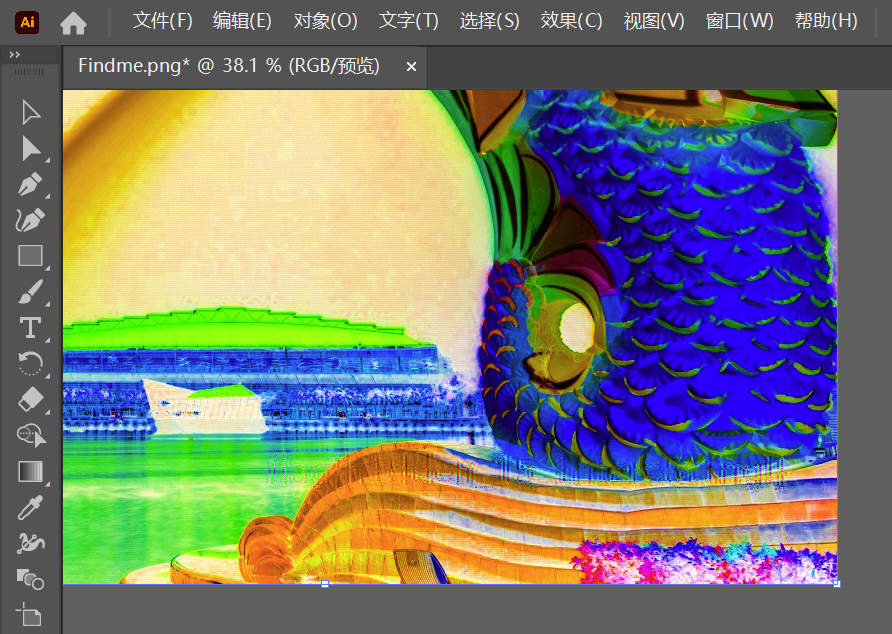
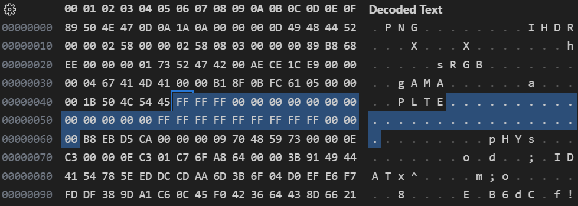

# Write Up

## 过了的题目
## Findme
其实比赛时间内只做出来这一题。但不知道怎么还能排在二十几名           
其实是全场最打酱油的题目。。。不知道为什么只有6个人做了（           
拿到这张图片，第一反应还以为是图寻。不过Google搜图一下就知道是网图，而且谁不认识鱼尾狮啊（            
WinHex看了一下压缩包和图片都很正常，没什么想法。还用 StegSolve 等工具看有没有末位隐藏信息，也无果。       
不过看到群里提示：           
> @全体成员 FindMe Hint: AI is all you need

想了一下：难道是AI能看到隐写的什么信息？（不过其实这样说也没错         
但是很快恍然大悟：这里的AI指的是Adobe Illustrator.                
一反色就昭然若揭。
再调高对比度饱和度，尽管还是很费眼睛，但是答案就在那里，总能看出来的。        
               

## 其他尝试了的题目
## Qrcode2
基本上一看到CTF就直奔二维码题了。毕竟只会这个嘛（之前靠补全二维码的技能，靠同学朋友圈露出一半的课程群二维码进群整蛊了一番，可见这项技能还是很实用的）               
用[QRazyBox](https://merri.cx/qrazybox/)手绘并还原，明显信息量不够。         
             
其实想法很简单，反正知道Mask Pattern是M0，手动把flag{和}这两块已知信息补进去，应该信息量就足够恢复了。              
但是真的没空去做😭

## Qrcode1
这个是最可惜的一集。               
扫出来的内容明显是 base64 ，解出来是残缺的一块 json 。                        
虽然不全，但是 pattern 很有特征（H4sIA这几个字母确实有着非常强的既视感，估计是B站的接口什么的见过）：搜索data里面包裹数据开头的「H4sIA」，找到这个[链接](https://blog.csdn.net/counsellor/article/details/83110949)，原来是base64套zip。
但是还少一半，怎么办呢。        

一开始以为是图种，搞来搞去弄不出来。WinHex看了，压缩包和解压出的图片都很清白，文件头尾没有冗余信息。            

比赛结束前一个小时还是觉得心有芥蒂，额外信息肯定藏在图里。          
于是调查了一下PNG的格式块。尝试改了一下 PLTE 里面的信息，立竿见影地，桌面上的预览图已经发生了变化，出现了斑驳的色彩。                      
                   

尝试之后明白了 PLTE 的原理，于是RGB三个数据一组，在000000和FFFFFF之间切换看效果。              
 
               

然后就出现了另外一个二维码，真是神奇啊。可惜时间已经不够了😩

## WhereIsMyFlag
`flag{760671da3ca23cae060262190c01e575873c72e6}`           
一直很好奇为什么这道题Repo里面什么都没有，却这么多人做出来               
赛后才发现：　　　　长　　　　行　　　　战　　　　术                         
原来我也会被这个坑到                 
而且先做这道题对Qrcode1的解压那步也有帮助（               
想着应该就是多解压几次，搞到最后0.98GB, 你对我的磁盘做了什么😡           

## f and r
找到[这篇博客](https://wumb0.in/extracting-and-diffing-ms-patches-in-2020.html)，跟着拆包了.msu，但是不会逆向里面的.exe，遂放弃。

------------------
## 碎碎念
这次纯粹打酱油，完全没有认真来玩，有点遗憾。主要是因为可恶的[大作业](https://github.com/ACMClassCourse-2023/STLite-ACM-2024/tree/main/map)😡            
之前高中时候对解谜感兴趣，之前玩过 CCBC 等解谜比赛。一次无意发现中科大 Hackergame 比赛，对这种有一点计算机背景的解谜特别感兴趣，当然水平仅限于做一些改URL啊，网络谜踪啊，检索信息啊之类的题目（现在也是，水平并无长进），但是也很有乐趣。            
所以这次也只看了Misc，希望以后能有能力做其他的部分。        

写这个WriteUp主要是为了证明，虽然靠一道水题拿了前30，但我还没那么水，还是很多题都想过了的（心虚
